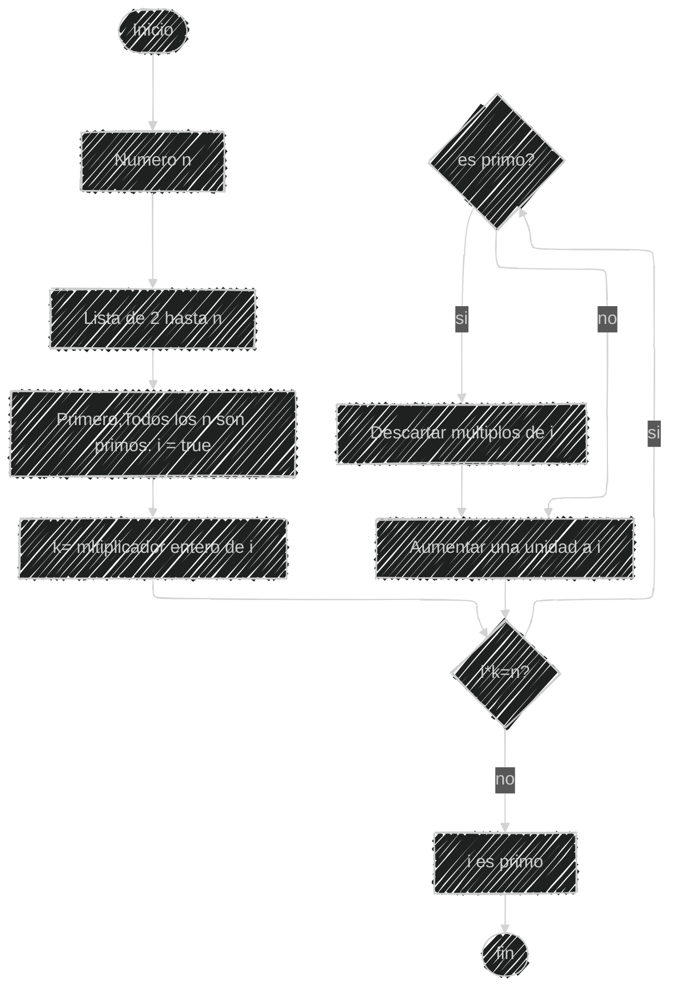

# Reto: Algoritmo para numeros Primos
---

En este repositorio encontraras un planteamiento del algoritmo para obtener los números primos hasta n, usando pseudocódigo y diagramas de flujo.

--- 
### Pseudocódigo
```
# definir variables: n (numero natural), i (numuero primo), k(multiplicador entero de i)
n: entero
i: entero
k: entero

# k toma valores mayores a 2
Inicio
i=2

Mientras (i*k <= n) hacer
   Si primo (i)= false
    entonces i= i+1
   Si no
    Eliminar multiplos de i
Fin si
Fin Mientras

Si (i*k <= n)= false entonces
   Escribir ("i es primo")
Fin si
Fin
```
#### Este pseudocodigo es otra manera de entnder o interpretar el siguiente diagrama de flujo 
--- 
### Diagrama de flujo


<details><summary>Eso es todo!</summary><p>
Espero este algoritmo haya sido claro e interesante 🤓


  

  
  
  

  
  


